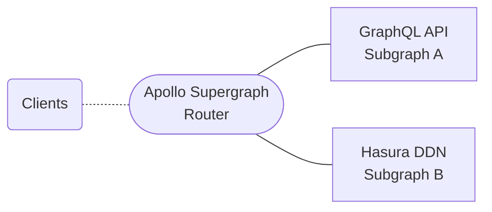

## Introduction

Hasura DDN itself can be used as a subgraph in a supergraph created by
[Apollo Federation](https://www.apollographql.com/docs/federation/). This page is to help you understand how to use
Hasura in conjunction with an existing Apollo supergraph. Alternatively, if you're looking for a guide on how to build a
federated Hasura DDN supergraph, check out our [getting started](/how-to-build-with-ddn/overview.mdx) guide.

Apollo Federation is a way to compose multiple GraphQL services (called subgraphs) into a unified API (called a
supergraph).

:::info Supergraphs and Subgraph terminology in Hasura DDN and Apollo Federation

Some of the naming used in Apollo Federation conflicts with the same names used in Hasura. Here is a quick glossary to
help you understand the terms better:

| Term       | Hasura                                                                                                       | Apollo Federation                                                                                               |
| ---------- | ------------------------------------------------------------------------------------------------------------ | --------------------------------------------------------------------------------------------------------------- |
| Subgraph   | A subgraph in Hasura is the notion of a module of Hasura supergraph metadata.                                | A subgraph in Apollo Federation is a **standalone GraphQL service.**                                            |
| Supergraph | A supergraph in Hasura is the collection of subgraph metadata and the resultant GraphQL API that is created. | A supergraph in Apollo Federation is a unified GraphQL API that is created by stitching multiple subgraph APIs. |

:::

## Using DDN as a subgraph

Hasura DDN is compliant with the
[Apollo Federation subgraph specification](https://www.apollographql.com/docs/federation/subgraph-spec/), so you can
plug Hasura DDN in as a subgraph in your Apollo federated supergraph.



## Enabling Apollo Federation fields in Hasura DDN metadata

You will need to edit the [`GraphqlConfig`](/supergraph-modeling/graphql-config.mdx#graphqlconfig-graphqlconfig) for the
supergraph to enable the fields required for schema stitching by the Apollo supergraph router. You will have to add the
following in the `definition` for `GraphqlConfig` (usually in `supergraph/graphql-config.hml` file):

```yaml
apolloFederation:
  enableRootFields: true
```

An example of the `graphql-config.hml` file with apollo federation fields enabled:

```yaml {8-9}
kind: GraphqlConfig
version: v1
definition:
  query:
    rootOperationTypeName: Query
  mutation:
    rootOperationTypeName: Mutation
  apolloFederation:
    enableRootFields: true
```

## Marking a Type as an Apollo Entity

Types defined in Hasura DDN can also be marked as
[Apollo Entities](https://www.apollographql.com/docs/federation/entities/). This will allow the same type to be resolved
from DDN (and your other subgraphs that defines the type) as well.

To mark a type as an entity, you will have to edit the metadata for the `ObjectType` and the `Model` which will be used
to resolve the type.

1. Add the keys for the `ObjectType`. The [keys](https://www.apollographql.com/docs/federation/entities/#1-define-a-key)
   can be defined as following in the
   [`definition.graphql`](/supergraph-modeling/types#objecttype-objecttypegraphqlconfiguration) for `ObjectType`:

   ```yaml
   apolloFederation:
     keys: # The fields that uniquely identifies the entity
       - fields:
           - id
   ```

2. Mark the `Model` that should act as the source for the entity. This can be done by adding the following in the
   [`definition.graphql`](/supergraph-modeling/models#model-modelgraphqldefinition) for `Model`:

   ```yaml
   apolloFederation:
     entitySource: true
   ```

:::info Single direction Federation support

Apollo Federation support in DDN only allows extending Apollo subgraphs with DDN types.

The other way i.e. extending DDN types with other Apollo subgraphs is not currently possible.

Consider the following configuration:

The `Review` type defined in DDN:

```graphql
type Review {
  id: ID!
  productId: ID!
  rating: Int!
  comment: String
}
```

The `Product` type defined in an Apollo subgraph:

```graphql
type Product @key(fields: "id") {
  id: ID!
  name: String!
}
```

In this example we cannot extend the `Review` type in DDN with the `Product` type from another Apollo subgraph.

:::
