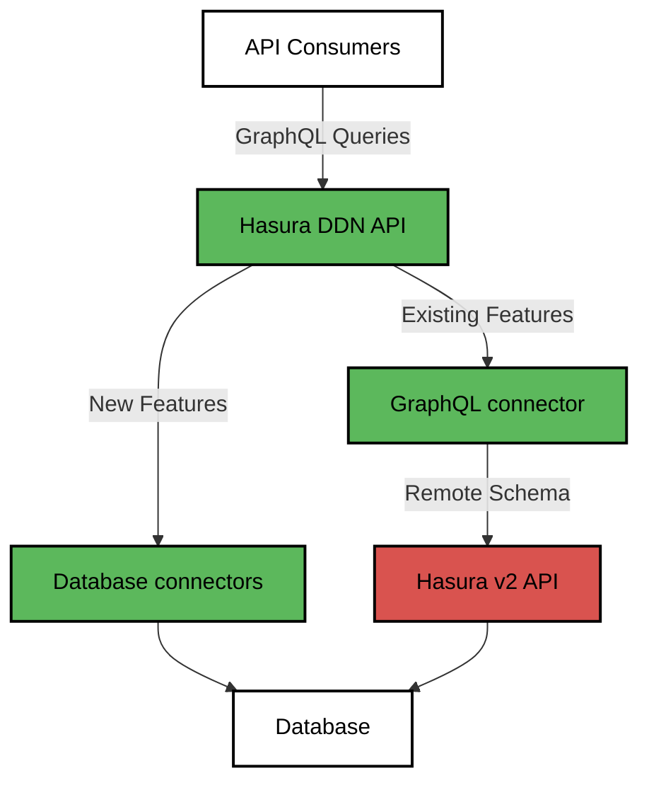
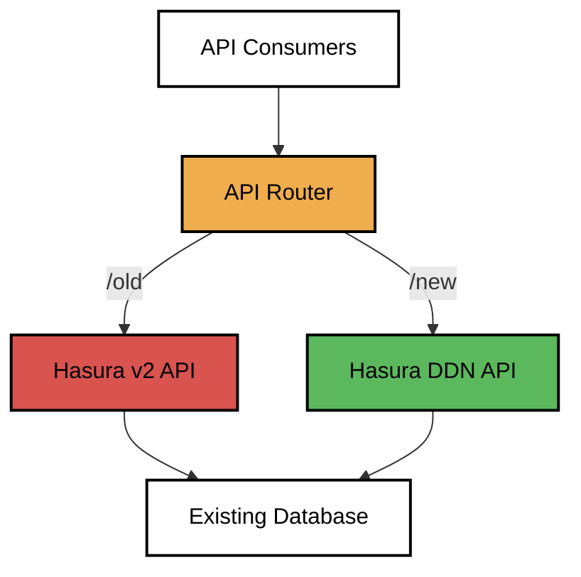
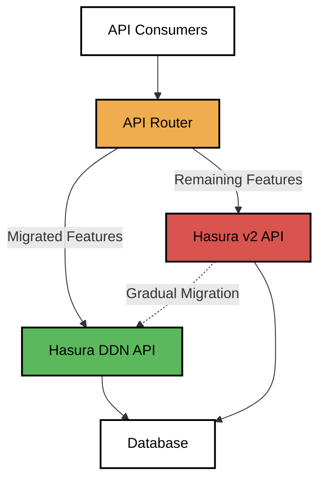

import Thumbnail from "@site/src/components/Thumbnail";

# Upgrade Guide

## Introduction

Currently, there is no in-place upgrade path from Hasura v2 to Hasura DDN. To upgrade your existing Hasura v2 instances
to Hasura DDN, please follow one of the below strategies.

**Note:** Hasura v2 is still supported and will be maintained according to our
[LTS policy](https://hasura.io/docs/2.0/policies/versioning/).

:::info Help is available

Our field engineering team is here to assist with the migration process. If you need help or have questions, please
reach out to us [here](https://hasura.io/contact-us).

:::

## Upgrade Strategies

When upgrading from Hasura v2 to Hasura DDN, you have multiple approaches to ensure a smooth transition while
maintaining service continuity for your existing API clients. Depending on your needs, you can either introduce the DDN
API as a separate endpoint, gradually phase out the v2 API, or integrate your existing v2 API as a remote schema in your
new DDN project.

**Note:** The [Strangler Fig pattern](https://learn.microsoft.com/en-us/azure/architecture/patterns/strangler-fig) can
be applied in two ways:

- **GraphQL-based Routing:** Use Hasura DDN to manage both systems by integrating Hasura v2 as a remote schema,
  progressively migrating functionalities while maintaining a unified API endpoint.
- **URL-based Routing:** Separate the old and new systems with distinct API endpoints,and gradually shift traffic from
  the old endpoint to the new one.

### GraphQL-based Routing using DDN

Leverage your existing Hasura v2 API as a remote schema within your new Hasura DDN project to ensure a seamless
migration process and minimize disruptions.

- **Create a DDN project:**
  - Begin by creating a new Hasura DDN project that will serve as the foundation for all new developments and
    migrations.
  - Ensure the DDN project is set up with the necessary configurations, including security policies, access controls,
    and environment settings.
- **Connect Hasura v2 as a remote schema:**

  - Incorporate your existing Hasura v2 project as a remote schema within the DDN project. This allows you to continue
    using the v2 API while progressively transitioning to DDN.
  - Use the NDC GraphQL connector to bring in v2 as a remote schema in DDN. Follow the directions provided
    [here](https://github.com/hasura/ndc-graphql) in the README to correctly configure the connection.
  - Ensure that the remote schema setup includes proper role handling and namespace management to avoid conflicts
    between v2 and DDN schemas.

- **Expose the DDN API to consumers:**

  - Make the DDN API available to consumers, offering a unified endpoint that encompasses both DDN and v2
    functionalities.
  - Keep the v2 project running behind the scenes to maintain continuity for existing consumers who have not yet
    migrated.
  - Provide detailed documentation and examples to help consumers understand how to interact with the DDN API,
    especially if there are changes from v2.

- **Iterate and update:**

  - Continue iterating on the v2 project as necessary, particularly for bug fixes, minor updates, or critical patches.
  - Simultaneously, ensure that any relevant updates or changes in v2 are reflected in the DDN project. This may involve
    updating GraphQL Connector schema and redeploying the connector and the supergraph.
  - Establish a version control strategy to manage changes in both v2 and DDN, reducing the risk of inconsistencies.

- **Add all new features to DDN:**

  - Develop and implement all new features directly within the DDN project to take advantage of its advanced
    capabilities especially around collaboration.
  - Consider adopting a modular approach to feature development, which allows for easier testing, deployment, and future
    migrations.

- **Migrate existing functionality to DDN:**

  - Gradually migrate existing functionalities from v2 to DDN, prioritizing high-impact or frequently used features.
  - During migration, test each functionality extensively in the DDN environment to ensure that it works as expected and
    does not introduce regressions.
  - Coordinate with API consumers to manage the transition, providing them with clear timelines and support during the
    migration process.

- **Deprecate v2 models via DDN:**

  - Gradually deprecate v2 GraphQL root fields using DDN metadata, signaling to consumers that they should transition to
    using DDN directly.
  - In DDN, use the `@deprecated` flag to mark fields in the v2 subgraph that are planned for removal.
  -     Example: If the `user` model in v2 is being replaced by a `UserNew` model in DDN, ensure that consumers are aware of the change and have sufficient time to update their implementations.
  - Implement a deprecation policy that includes clear timelines, documentation, and communication strategies to avoid
    disruptions.

- **Monitor and Support:**

  - Continuously monitor the performance and usage of both v2 and DDN APIs, using analytics and logging to identify any
    issues or areas for improvement.
  - Provide ongoing support to consumers, addressing their concerns and assisting with the migration process. This could
    include dedicated support channels, migration guides, and technical workshops.

- **Plan for Final Decommissioning:**

  - As more functionalities are migrated and consumers transition to DDN, begin planning for the final decommissioning
    of the v2 project.
  - This should involve a phased approach, where critical functionalities are retained until the very end, and less
    critical or redundant features are decommissioned first.
  - Communicate decommissioning plans well in advance to give consumers ample time to complete their transitions.

- **Cons:**
  - Dual Maintenance: Any changes in the v2 project will require updates in both v2 and DDN, leading to additional
    maintenance overhead.
  - GraphQL Connector Limitations:
    - Subscriptions: DDN cannot proxy v2 subscriptions, which may require a separate handling strategy for real-time
      data needs.
      - Subscription support is on the roadmap for DDN and expected to be released in the Sep/Oct timeframe.
    - Directives: Certain directives, like caching mechanisms and Apollo federation features, cannot be proxied through
      the DDN, which might limit some advanced use cases.
      - Apollo Federation is supported in DDN. Caching is on the roadmap and will be released by end of September.
    - Unions and Interfaces: GraphQL unions and interfaces may face limitations when being proxied, necessitating
      careful schema design and potential workarounds.

**This approach provides a structured and gradual migration path, leveraging the strengths of both systems while
minimizing disruptions to your API consumers. However, careful planning and communication are essential to manage the
complexities involved.**

### URL-based Routing

This strategy involves using URL-based routing to direct traffic between the old and new GraphQL APIs similar to the

- **Routing Example:**
  - `/old` → v2
  - `/new` → DDN
- **Pros:**
  - Allows you to maintain a clear separation between the old and new systems.
- **Cons:**
  - It might not be feasible for clients to handle two separate GraphQL endpoints.
  - Hasura v2 does not have API deprecation features so would be tough to communicate to API consumers about migration.

#### Parallel Deployment

- Move all new development to Hasura DDN while maintaining two separate APIs: one for Hasura v2 and one for Hasura DDN.
  This allows you to take advantage of new features and optimizations in DDN without disrupting existing workflows in
  v2.
- Establish Clear Boundaries: Define clear boundaries between the functionalities that remain in v2 and those that are
  developed in DDN. This will help avoid duplication of effort and ensure a smooth transition for consumers.
- Update Documentation: Provide thorough documentation for the new DDN API, including examples, usage guidelines, and
  any changes from the v2 API. Ensure that your development and support teams are well-informed about the differences
  between the two APIs.
- Consumer Communication: Inform API consumers about the introduction of the new DDN API, providing details on how to
  use the new API if needed.
- Monitor Performance: Regularly monitor the performance and usage of both APIs. This will help you identify any issues
  early on and ensure that both systems are running efficiently.
- Plan for Future Migration: Although v2 and DDN will run in parallel for some time, plan for the eventual migration of
  all v2 features to DDN. This plan should include timelines, resource allocation, and a strategy for decommissioning
  the v2 API when appropriate.
- Evaluate the Impact: Regularly evaluate the impact of running parallel APIs on your infrastructure, costs, and team
  workload. Adjust your strategy as needed to ensure a smooth and efficient transition.

This approach provides flexibility, allowing your team to leverage the benefits of Hasura DDN while maintaining
stability in the existing Hasura v2 environment.

#### Phased Deprecation

- Start migrating features from Hasura v2 to Hasura DDN incrementally. Begin with non-critical or less complex features
  to minimize risk.
- As features are successfully migrated to DDN, remove those features from the Hasura v2 project. This ensures that no
  duplicate functionality exists across both systems, reducing maintenance overhead.
- Communicate any feature removal from v2 to your API consumers well in advance. Provide clear documentation on how to
  access the migrated features in DDN, including any changes in API endpoints or data structures.
- Implement a deprecation policy for features in v2 that are slated for removal. This may involve marking endpoints as
  deprecated with a clear timeline for their eventual removal.
- Monitor the usage of both v2 and DDN during the transition. Track which clients are still using v2 features and
  encourage them to transition to DDN by providing support and resources.
- Offer support and guidance to API consumers during the migration process. This could include providing sample code,
  migration guides, or direct assistance from your development team.
- Consider implementing versioning strategies if there are breaking changes. This can help maintain backward
  compatibility and give consumers more time to migrate at their own pace.
- Continuously test both systems in parallel to ensure that the migrated features are functioning as expected in DDN.
  This will help catch any issues early and avoid disruptions.
- Once all critical features have been migrated and consumers have successfully transitioned, begin phasing out the
  Hasura v2 project. This could involve shutting down v2 endpoints, archiving the v2 project, and reallocating resources
  to support DDN.

## Learn More

With any of these strategies, you'll need a clear understanding of the features and functionalities that need to be
migrated. We recommend creating a plan to do feature by feature manual migration. Check out
[this page](/upgrade/feature-availability/index.mdx) for a detailed comparison of the features available between Hasura
v2 and Hasura DDN, and directions on how to migrate them.
