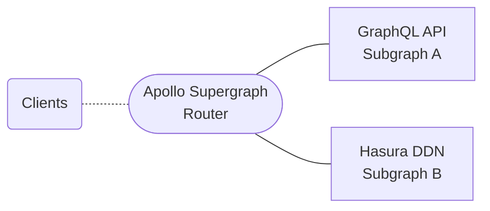

## Introduction
Hasura DDN can be used as a subgraph in a supergraph built using [Apollo
Federation](https://www.apollographql.com/docs/federation/). Apollo Federation is a way to compose multiple GraphQL
services (called subgraphs) into a unified API (called supergraph).

:::info Let's learn about some terms used by Hasura as well as Apollo

Some of the terms used in Apollo Federation conflict with the terms used in Hasura. Here is a quick glossary to help you understand the terms better:

| Term       | Hasura                                                                                             | Apollo Federation                                                                                               |
| ---------- | -------------------------------------------------------------------------------------------------- | --------------------------------------------------------------------------------------------------------------- |
| Subgraph   | A subgraph in Hasura is a notion of a module system for Hasura metadata.                           | A subgraph in Apollo Federation is a standalone GraphQL service.                                                |
| Supergraph | A supergraph in Hasura is the GraphQL API that is created by combining multiple subgraph metadata. | A supergraph in Apollo Federation is a unified GraphQL API that is created by stitching multiple subgraph APIs. |

:::

## Using DDN as a subgraph

DDN is [Apollo Federation subgraph specification](https://www.apollographql.com/docs/federation/subgraph-spec/)
compliant, so you can plug Hasura DDN as a subgraph in your Apollo federated supergraph.




## Enabling Apollo Federation fields in metadata

You will need to edit the `GraphqlConfig` for the supergraph to enable the fields required for schema stitching by the
Apollo supergraph router. You will have to add the following in the `definition` for `GraphqlConfig`:

```yaml
apolloFederation:
  enableRootFields: true
```

## Marking Type as Apollo Entity

Types defined in Hasura DDN can also be marked as [Entities](https://www.apollographql.com/docs/federation/entities/).
This will allow the same type to be resolved from DDN (and your other subgraphs that defines the type) as well.

To mark a type as an entity, you will have to edit the metadata for the `ObjectType` and the `Model` which will be
used to resolve the type.

1. You will have to add the keys for the `ObjectType`. The
   [keys](https://www.apollographql.com/docs/federation/entities/#1-define-a-key) can be defined as following in the
   `graphql.definition` for `ObjectType`:

   ```yaml
   apolloFederation:
     keys: # The fields that uniquely identifies the entity
       - fields:
         - id
   ```

2. You will have to mark the Model that should act as the source for the entity. This can be done by adding the
   following in the `graphql.definition` for `Model`:

   ```yaml
   apolloFederation:
     entitySource: true
   ```
