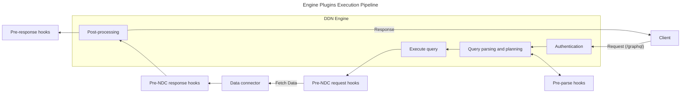
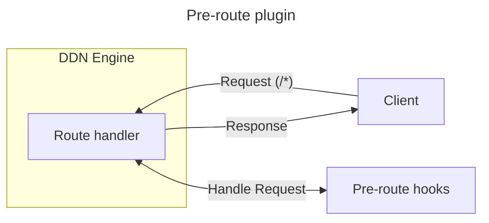
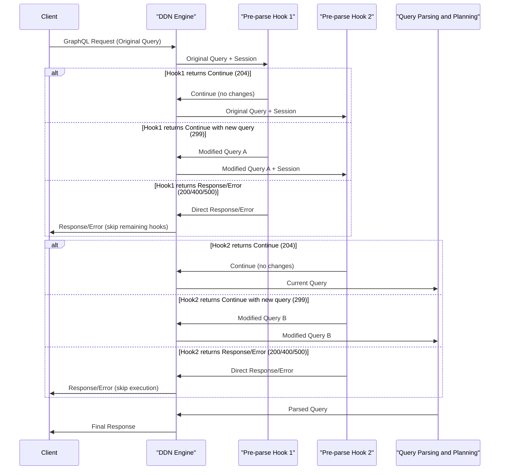
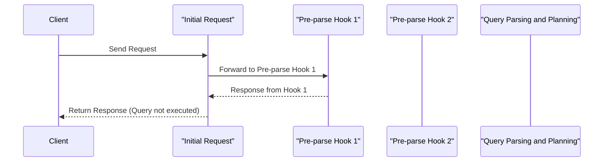
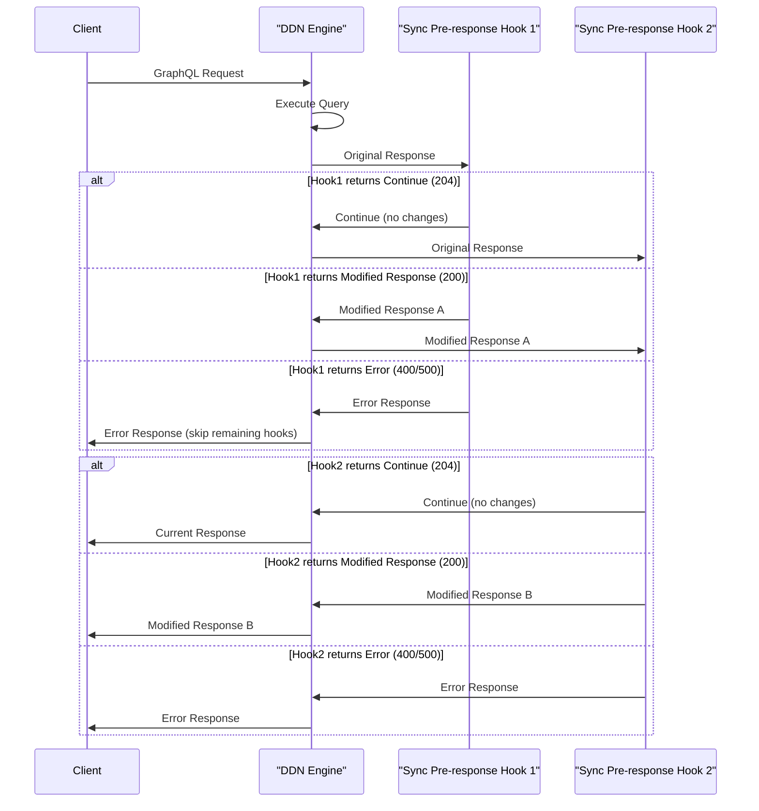
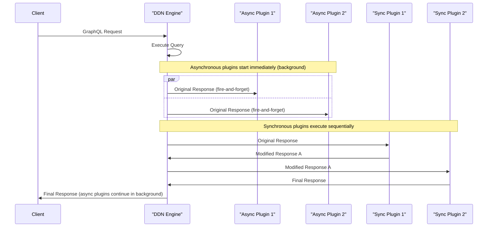
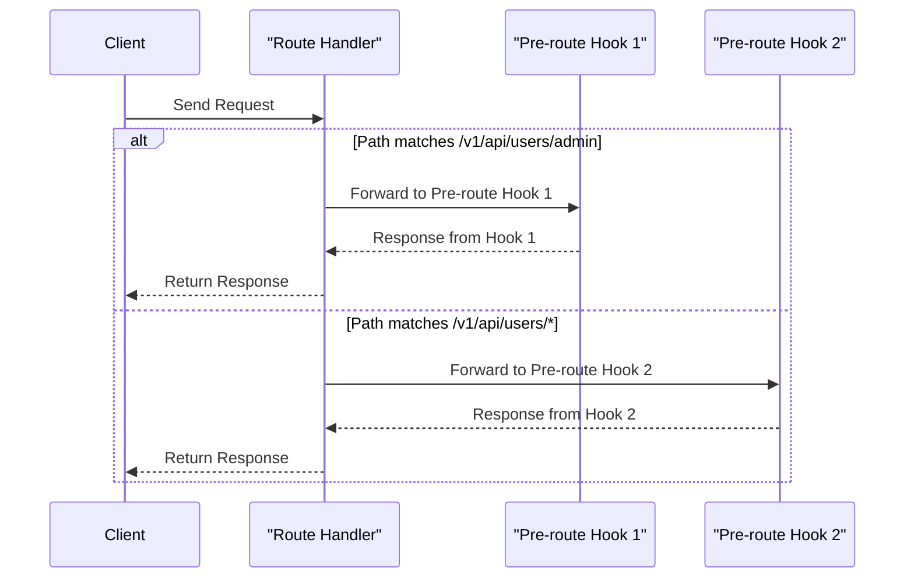

import Thumbnail from "@site/src/components/Thumbnail";

# How Plugins Work

## Introduction

Engine plugins are HTTP servers that run alongside a Hasura DDN instance and can be written in any language capable of
running an HTTP server.

They are configured in DDN using metadata. The engine sends HTTP requests to the plugin at the specified execution step,
the plugin processes the request, and then sends a response back to the engine, which continues execution based on the
plugin's response.

Plugins can be applied at the following steps:

| Execution Step       | Description                                                                                                                                                   | Example Usage                                                                                   |
| -------------------- | ------------------------------------------------------------------------------------------------------------------------------------------------------------- | ----------------------------------------------------------------------------------------------- |
| **Pre-Parse**        | The first step in the execution pipeline, where custom logic can be applied before the query is parsed and its internal representation is generated.          | Add an allowlist layer to restrict access to specific queries and mutations.                    |
| **Pre-NDC Request**  | Applied before sending requests to data connectors, allowing modification of NDC requests or returning responses directly without calling the data connector. | Transform requests, implement caching by returning cached responses, or add request validation. |
| **Pre-NDC Response** | Applied after receiving responses from data connectors, allowing modification of NDC responses.                                                               | Transform or enrich data connector responses, or store responses for caching purposes.          |
| **Pre-Response**     | The final step in the execution pipeline, where custom logic can be added after the query is executed but before the response is sent to the client.          | Trigger Slack notifications after a mutation is executed.                                       |
| **Pre-Route**        | The first step in the routing pipeline, where custom logic can be applied to the requests on other than pre-defined endpoints.                                | Add a custom endpoint to DDN.                                                                   |

## Architecture





## Plugin Configuration

Engine plugins are configured in DDN using metadata. The metadata specifies the URL of the engine plugin and the
execution step at which the plugin should be called. The configuration also can control the request that is sent to the
engine plugin.

```yaml title="Here is an example of a plugin configuration in DDN metadata:"
kind: LifecyclePluginHook
version: v1
definition:
  name: cloudflare allowlist
  url:
    valueFromEnv: ALLOW_LIST_URL
  pre: parse
  config:
    request:
      headers:
        additional:
          hasura-m-auth:
            value: "your-strong-m-auth-key"
      session: {}
      rawRequest:
        query: {}
        variables: {}
```

In this example, the plugin is configured to run at the `pre-parse` execution step. The plugin is called
`cloudflare allowlist`. The URL of the plugin is read from the `ALLOW_LIST_URL` environment variable. The plugin is
configured to add a `hasura-m-auth` header to the request with the value `your-strong-m-auth-key`.

Additionally, the request sent to the plugin includes the query and variables from the incoming GraphQL request, as well
as the session information from the incoming request.

## Pre-Parse Plugin

The `pre-parse` plugin is triggered at the first step in the execution pipeline, before the query is parsed. Use this
step to add custom logic before parsing begins.

For pre-parse plugin configuration
[click here](reference/metadata-reference/engine-plugins.mdx#lifecyclepluginhook-lifecyclepreparsepluginhook).

### Pre-Parse Plugin Request

```json title="A sample request that is sent to the pre-parse plugin is as follows:"
{
  "rawRequest": {
    "query": "query MyQuery { getAuthorById(author_id: 10) { first_name } }",
    "variables": {},
    "operationName": "MyQuery"
  },
  "session": {
    "role": "user",
    "variables": {
      "x-hasura-role": "user",
      "x-hasura-user-id": "123"
    }
  }
}
```

:::info Customize the request

The request sent to the plugin can be customized based on the plugin's
[configuration](reference/metadata-reference/engine-plugins.mdx#lifecyclepluginhook-lifecyclepreresponsepluginhookconfigrequest).

:::

### Pre-Parse Plugin Response

The `pre-parse` plugin has the ability to control the execution pipeline by returning a specific response to DDN. The
response determines whether execution continues, halts, or returns an error. The possible response types are:

| Response Type             | HTTP Status Code | Response Body        | Description                                                                                    |
| ------------------------- | ---------------- | -------------------- | ---------------------------------------------------------------------------------------------- |
| `Continue`                | `204`            | None                 | Execution continues without interruption.                                                      |
| `Response`                | `200`            | Response body        | Execution halts, and the provided response is returned to the client.                          |
| `Continue with new query` | `299`\*          | GraphQL query object | Execution continues with the modified GraphQL query.                                           |
| `User Error`              | `400`            | Error object         | Execution halts, and the provided error is returned to the client as a user error.             |
| `Internal Error`          | `500`            | Error object         | Execution halts, and the provided error is returned to the client as an internal server error. |

\*_Note: HTTP status code 299 is a non-standard code specifically used by DDN for query modification._

:::warning Response Validation

DDN does not validate the plugin's response. It is the plugin's responsibility to ensure the response is valid and
aligns with its intended logic.

:::

### Use Cases

The `pre-parse` plugin can be used to add a multitude of functionalities to DDN. Some use cases are:

- **Allowlist**: Add an allowlist layer to restrict access to specific queries and mutations based on the incoming
  request and session information.
- **Basic Rate Limiting**: Implement rate limiting to restrict the total number of requests that can be made to DDN in a
  given time period.
- **Custom Query Validation**: Add custom query validation logic to ensure that the incoming query is valid based on
  custom business logic.
- **Cache Get**: Implement a cache get layer to fetch the response from the cache before executing the query.
- **Query Transformation**: Transform queries to use different field names or structures for API versioning
- **Deprecation Management**: Automatically update queries using deprecated fields to use current alternatives
- **Multi-tenant Query Injection**: Add tenant-specific filters to ensure data isolation

### Multiple Pre-Parse Plugins

You can configure multiple pre-parse plugins in DDN metadata. These plugins execute in the order they are listed in the
metadata configuration.

If a plugin returns a `Response`, `User Error`, or `Internal Error`, the execution stops immediately, and the response
is sent back to the client. Any plugins defined after that will not run.

Let’s consider an example where the engine uses two pre-parse plugins: `Pre-parse Hook 1` and `Pre-parse Hook 2`.



Here’s how the process works:

#### Case 1: Continue

If `Pre-parse Hook 1` returns a `Continue` response (HTTP status code 204), the engine proceeds to send the request to
`Pre-parse Hook 2`. This continues until all configured pre-parse plugins have been executed.

:::tip Continue response body

The `Continue` response body is ignored by DDN. Plugins returning a `Continue` response can safely leave the body empty.

:::

#### Case 2: Continue with new query

If `Pre-parse Hook 1` returns a `Continue with new query` response (HTTP status code 299), the engine proceeds to send
the request to `Pre-parse Hook 2` with the modified query. Each subsequent plugin in the chain receives the query as
modified by the previous plugin. This continues until all configured pre-parse plugins have been executed.

**Response Body Requirements:** The `Continue with new query` response body must contain a valid GraphQL query object.
The expected response body format is:

```json
{
  "query": "query MyQuery($author_id: Int!) { getAuthorById(author_id: $author_id) { first_name last_name email } }",
  "variables": { "author_id": 10 },
  "operationName": "MyQuery"
}
```

**Error Handling:**

- If the query syntax is invalid, the engine will return a GraphQL syntax error to the client
- If the response body is malformed JSON, the engine will return a 400 Bad Request error
- If required fields (`query`) are missing, the engine will return a validation error
- Variables and operationName are optional but should match the query if provided

**Query Transformation Sequence:**

1. Original query → Pre-parse Hook 1 → Modified Query A
2. Modified Query A → Pre-parse Hook 2 → Modified Query B
3. Modified Query B → Query execution

#### Case 3: Response, User Error, or Internal Error

If `Pre-parse Hook 1` returns any of the following:

- `Response` (HTTP status code 200)
- `User Error` (HTTP status code 400)
- `Internal Error` (HTTP status code 500)

The engine stops further execution and sends the response to the client and other plugins will not be called.



:::info Will subsequent pre-response plugins execute?

Yes, even if a pre-parse plugin returns a `Response`, `User Error`, or `Internal Error`, the subsequent `pre-response`
plugins will still execute.

:::

If all pre-parse plugins return a `Continue` response (HTTP status code 204) or a `Continue with new query` response
(HTTP status code 299), the engine completes execution and sends its generated response to the client.

:::info Query Modification Capabilities

**Can pre-parse plugins modify the request?**

Yes, pre-parse plugins can modify the GraphQL query by returning a `Continue with new query` response (HTTP status code
299).

**Use Cases for Query Modification:**

- **Query allowlisting with transformation**: Transform blocked queries into allowed alternatives
- **Field-level access control**: Remove unauthorized fields from queries based on user permissions
- **Deprecation handling**: Automatically update queries using deprecated fields to use new alternatives
- **Multi-tenancy**: Inject tenant-specific filters into queries
- **Query normalization**: Standardize query format and structure

Please note that the session information will be carried forward and cannot be modified by pre-parse plugins.

:::

## Pre-Response Plugin

The `pre-response` plugin is triggered at the final step in the execution pipeline after the query is executed. Use this
step to add webhooks after the query is executed. Pre-response plugins can operate in two modes: asynchronous (default)
or synchronous.

For pre-response plugin configuration
[click here](reference/metadata-reference/engine-plugins.mdx#lifecyclepluginhook-lifecyclepreresponsepluginhook).

### Pre-Response Plugin Request

```json title="A sample request that is sent to the pre-response plugin is as follows:"
{
  "response": {
    "data": {
      "getAuthorById": {
        "first_name": "John"
      }
    }
  },
  "session": {
    "role": "user",
    "variables": {
      "x-hasura-role": "user",
      "x-hasura-user-id": "123"
    }
  },
  "rawRequest": {
    "query": "query MyQuery { getAuthorById(author_id: 10) { first_name } }",
    "variables": {},
    "operationName": "MyQuery"
  }
}
```

:::info Customize the request

The request sent to the plugin can be customized based on the plugin's
[configuration](reference/metadata-reference/engine-plugins.mdx#lifecyclepluginhook-lifecyclepreresponsepluginhookconfigrequest).

:::

### Pre-Response Plugin Modes

Pre-response plugins can operate in two modes:

#### Asynchronous Mode (Default)

In asynchronous mode, the engine sends requests to the plugin but does not wait for a response. The engine immediately
sends the response to the client after executing the query. This is the default behavior if no mode is specified.

The response from asynchronous pre-response plugins is ignored by DDN.

```yaml title="Example configuration for an asynchronous pre-response plugin:"
kind: LifecyclePluginHook
version: v1
definition:
  name: async-pre-response-plugin
  url:
    valueFromEnv: PRE_RESPONSE_URL
  pre: response
  config:
    request:
      headers:
        additional:
          hasura-m-auth:
            value: "your-strong-m-auth-key"
      session: {}
      rawRequest:
        query: {}
        variables: {}
    mode:
      type: asynchronous
```

#### Synchronous Mode

In synchronous mode, the engine waits for the plugin to respond before sending the response to the client. This allows
the plugin to modify the response or perform actions that must complete before the client receives the response.

```yaml title="Example configuration for a synchronous pre-response plugin:"
kind: LifecyclePluginHook
version: v1
definition:
  name: sync-pre-response-plugin
  url:
    valueFromEnv: PRE_RESPONSE_URL
  pre: response
  config:
    request:
      headers:
        additional:
          hasura-m-auth:
            value: "your-strong-m-auth-key"
      session: {}
      rawRequest:
        query: {}
        variables: {}
    mode:
      type: synchronous
      onPluginFailure: continue
```

The `config.mode.type: synchronous` parameter enables synchronous operation, and `config.mode.onPluginFailure: continue`
determines how the engine should handle failures in the plugin. The `onPluginFailure` can be set to either `continue` or
`fail`.

Synchronous pre-response plugins can return the following responses:

| Response Type       | HTTP Status Code | Response Body     | Description                                                                |
| ------------------- | ---------------- | ----------------- | -------------------------------------------------------------------------- |
| `Continue`          | `204`            | None              | The original response will be sent to the client without modification.     |
| `Modified Response` | `200`            | Modified response | The modified response will be sent to the client instead of the original.  |
| `User Error`        | `400`            | Error object      | The plugin encountered a user error, which will be returned to the client. |
| `Internal Error`    | `500`            | Error object      | Treated as an internal server error and returned to the client.            |

:::note Performance Considerations Synchronous pre-response plugins add latency to the request processing as the engine
must wait for the plugin to respond before sending the response to the client. Asynchronous plugins do not add latency
as they run in parallel with the response being sent to the client. :::

### Use Cases

The `pre-response` plugin can be used to add a number of functionalities to DDN:

#### Asynchronous Use Cases

- **Slack Notifications**: Trigger Slack notifications after a query/mutation is executed.
- **Audit Logs**: Add audit logs to track the queries and mutations executed by the users.
- **Analytics**: Collect analytics data about API usage patterns.
- **Cache Set**: Implement a cache set layer to store the response in the cache for future requests.
- **Cache Invalidation**: Implement a cache invalidation layer to invalidate the cache based on the incoming request.

#### Synchronous Use Cases

- **Response Transformation**: Modify or enrich the response data before it reaches the client.
- **Data Masking**: Remove sensitive information from responses based on user permissions.
- **Response Validation**: Validate responses against business rules before sending to clients.
- **Adding Extensions**: Add custom extensions to the GraphQL response, such as timestamps, custom metadata, or computed
  summary information.

### Multiple Pre-Response Plugins

Multiple `pre-response` plugins can be configured in DDN metadata.

#### Multiple Asynchronous Plugins

For asynchronous plugins, the engine sends requests to all configured plugins in parallel. It does not wait for
responses from the plugins and immediately sends the response generated by the engine to the client.

#### Multiple Synchronous Plugins

For synchronous plugins, the engine processes them in the order they are defined in the metadata. Each plugin receives
the response as potentially modified by the previous plugin, creating a chain of response transformations.



:::tip Plugin Ordering If you have multiple synchronous pre-response plugins that need to be executed in a specific
order, define them in a single HML file. This ensures they are processed in the exact sequence you specify. :::

#### Combining Synchronous and Asynchronous Plugins

You can configure both synchronous and asynchronous pre-response plugins together. In this case:

1. **Asynchronous plugins start executing immediately** in the background (fire-and-forget)
2. **Synchronous plugins execute sequentially** in the order they are defined, creating a chain of response
   transformations
3. **The client receives the response** after synchronous plugins finish, while asynchronous plugins continue running in
   the background



This approach allows you to:

- **Start background tasks immediately** using asynchronous plugins for logging, notifications, or analytics
- **Transform responses** using synchronous plugins before the client receives them
- **Optimize performance** by running non-blocking operations in parallel while only adding latency for operations that
  must complete before the response is sent

## Pre-Route Plugin

The `pre-route` plugin is triggered at the first step in the routing stage, before the request is routed to the handler.
Use this step to add custom HTTP handlers to DDN. Please note that the pre-route plugin can only handle requests that do
not match DDN's pre-defined endpoints (`/graphql`, `/v1/sql`, `/v1/jsonapi`, `/v1/explain`, `/healthz` and `/metrics`).

[See the reference here](reference/metadata-reference/engine-plugins.mdx#lifecyclepluginhook-lifecyclepreroutepluginhook)
for pre-route plugin metadata configuration.

### Pre-Route Plugin Request

A sample request that is sent to the `pre-route` plugin is as follows:

```json
{
  "path": "/v1/rest/users/5",
  "method": "POST",
  "query": "limit=10&offset=0"
  "body": {
    "name_like": "%foo%"
  }
}
```

:::info Customize the request

The request sent to the plugin can be customized based on the plugin's
[configuration](reference/metadata-reference/engine-plugins.mdx#lifecyclepluginhook-lifecyclepreroutepluginhookconfigrequest).

:::

### Pre-Route Plugin Response

The `pre-route` plugin have absolute control over the execution pipeline for the configured path. The plugin can return
any of the following responses to DDN:

| Response Type    | HTTP Status Code | Response Body | Description                                                 |
| ---------------- | ---------------- | ------------- | ----------------------------------------------------------- |
| `Success`        | `200`            | Response body | Return the response to the client.                          |
| `User Error`     | `400`            | Error object  | Stop the execution and return the error to the client.      |
| `Internal Error` | `500`            | Error object  | Stop the execution and return internal error to the client. |

### Use Cases

The `pre-route` plugin can be used to add custom endpoints to DDN which are not part of the pre-defined DDN endpoints.
Some use cases are:

- **RESTified Endpoints**: Turn GraphQL queries into REST endpoints.
- **Internal tools**: Add internal tools like graphql schema visualizers like graphql-voyager, Swagger UI for JSON API,
  etc.

### Multiple Pre-Route Plugins

Multiple `pre-route` plugins can be configured in DDN metadata to handle requests to different paths. However, if more
than one plugin matches the request path, the first plugin in the list is executed and the subsequent plugins are
ignored.

So, while defining multiple `pre-route` plugins, make sure that the more specific paths are defined first.

Let's take an example where the engine is configured with two `pre-route` plugins: `Pre-route hook 1` (for path
`/v1/api/users/admin`) and `Pre-route hook 2` (for path `/v1/api/users/*`). We want to handle the request to GET admin
user details (a more specific path) using `Pre-route hook 1` and the request to GET user with an ID (a less specific
path) using `Pre-route hook 2`. For this, we need to define the `Pre-route hook 1` first in the metadata.



In this example, the engine is configured with two `pre-route` plugins. The engine sends the request to either
`Pre-route hook 1` or `Pre-route hook 2` based on the path. If the path matches `/v1/api/users/admin`, the engine sends
the request to `Pre-route hook 1`. If the path matches `/v1/api/users/*`, the engine sends the request to
`Pre-route hook 2`.

## Pre-NDC Request Plugin

The `pre-ndc-request` plugin is triggered before sending requests to data connectors. This plugin can either modify the
NDC request or return a response directly, bypassing the data connector call entirely.

There can only be one `pre-ndc-request` plugin configured per data connector.

For pre-ndc-request plugin configuration
[click here](reference/metadata-reference/engine-plugins.mdx#lifecyclepluginhook-lifecyclepluginhook-lifecycleprendcrequestpluginhook).

### Pre-NDC Request Plugin Request

A sample request that is sent to the `pre-ndc-request` plugin is as follows:

```json
{
  "session": {
    "role": "user",
    "variables": {
      "x-hasura-role": "user",
      "x-hasura-user-id": "123"
    }
  },
  "ndcRequest": {
    "collection": "users",
    "query": {
      "fields": {
        "id": {
          "type": "column",
          "column": "id"
        },
        "name": {
          "type": "column",
          "column": "name"
        }
      }
    },
    "arguments": {},
    "collection_relationships": {}
  },
  "dataConnectorName": "my_connector",
  "operationType": "query",
  "ndcVersion": "v0.2.x"
}
```

:::info Customize the request

The request sent to the plugin can be customized based on the plugin's
[configuration](reference/metadata-reference/engine-plugins.mdx#lifecyclepluginhook-lifecyclepluginhook-lifecycleprendcrequestpluginhookconfigrequest).

:::

### Pre-NDC Request Plugin Response

The plugin can respond in the following ways:

| Response Type      | HTTP Status Code | Response Body            | Description                                                                |
| ------------------ | ---------------- | ------------------------ | -------------------------------------------------------------------------- |
| `Continue`         | `204`            | None                     | The original request will be used without modification.                    |
| `Modified Request` | `200`            | `{"ndcRequest": {...}}`  | A modified request that will replace the original.                         |
| `Direct Response`  | `200`            | `{"ndcResponse": {...}}` | A response that will be used instead of calling the data connector.        |
| `User Error`       | `400`            | Error object             | The plugin encountered a user error, which will be returned to the client. |
| `Internal Error`   | `500`            | Error object             | Treated as an internal error.                                              |

### Use Cases

The `pre-ndc-request` plugin can be used for various functionalities:

- **Request Transformation**: Modify NDC requests before they reach the data connector.
- **Request Validation**: Validate requests and return errors for invalid operations.
- **Caching**: Return cached responses directly without calling the data connector.
- **Request Logging**: Log all requests for audit purposes while allowing them to proceed.
- **Mock Responses**: Return mock data for testing or development environments.

### Example Configuration

```yaml title="Here is an example of a pre-ndc-request plugin configuration in DDN metadata:"
kind: LifecyclePluginHook
version: v1
definition:
  name: my-pre-ndc-request-plugin
  url:
    valueFromEnv: PRE_NDC_REQUEST_PLUGIN_URL
  pre: ndcRequest
  connectors:
    - my_postgres_connector
  config:
    request:
      headers:
        additional:
          hasura-m-auth:
            value: "your-strong-m-auth-key"
      session: {}
      ndcRequest: {}
```

## Pre-NDC Response Plugin

The `pre-ndc-response` plugin is triggered after receiving responses from data connectors but before further processing.
This plugin allows modification of NDC responses.

There can only be one `pre-ndc-response` plugin configured per data connector.

For pre-ndc-response plugin configuration
[click here](reference/metadata-reference/engine-plugins.mdx#lifecyclepluginhook-lifecyclepluginhook-lifecycleprendcresponsepluginhook).

### Pre-NDC Response Plugin Request

A sample request that is sent to the `pre-ndc-response` plugin is as follows:

```json
{
  "session": {
    "role": "user",
    "variables": {
      "x-hasura-role": "user",
      "x-hasura-user-id": "123"
    }
  },
  "ndcRequest": {
    "collection": "users",
    "query": {
      "fields": {
        "id": {
          "type": "column",
          "column": "id"
        }
      }
    }
  },
  "ndcResponse": {
    "rows": [
      {
        "id": 1
      },
      {
        "id": 2
      }
    ]
  },
  "dataConnectorName": "my_connector",
  "operationType": "query",
  "ndcVersion": "v0.2.x"
}
```

:::info Customize the request

The request sent to the plugin can be customized based on the plugin's
[configuration](reference/metadata-reference/engine-plugins.mdx#lifecyclepluginhook-lifecyclepluginhook-lifecycleprendcresponsepluginhookconfigrequest).

:::

### Pre-NDC Response Plugin Response

The plugin can respond in the following ways:

| Response Type       | HTTP Status Code | Response Body         | Description                                                                |
| ------------------- | ---------------- | --------------------- | -------------------------------------------------------------------------- |
| `Continue`          | `204`            | None                  | The original response will be used without modification.                   |
| `Modified Response` | `200`            | Modified NDC response | A modified NDC response that will replace the original.                    |
| `User Error`        | `400`            | Error object          | The plugin encountered a user error, which will be returned to the client. |
| `Internal Error`    | `500`            | Error object          | Treated as an internal error.                                              |

### Use Cases

The `pre-ndc-response` plugin can be used for:

- **Response Transformation**: Modify or enrich data connector responses.
- **Data Filtering**: Filter sensitive data from responses based on user permissions.
- **Response Caching**: Store responses for future caching purposes.
- **Response Logging**: Log responses for audit or analytics purposes.
- **Data Enrichment**: Add additional data to responses from external sources.

### Example Configuration

```yaml title="Here is an example of a pre-ndc-response plugin configuration in DDN metadata:"
kind: LifecyclePluginHook
version: v1
definition:
  name: my-pre-ndc-response-plugin
  url:
    valueFromEnv: PRE_NDC_RESPONSE_PLUGIN_URL
  pre: ndcResponse
  connectors:
    - my_postgres_connector
  config:
    request:
      headers:
        additional:
          hasura-m-auth:
            value: "your-strong-m-auth-key"
      session: {}
      ndcRequest: {}
      ndcResponse: {}
```
