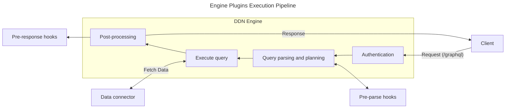
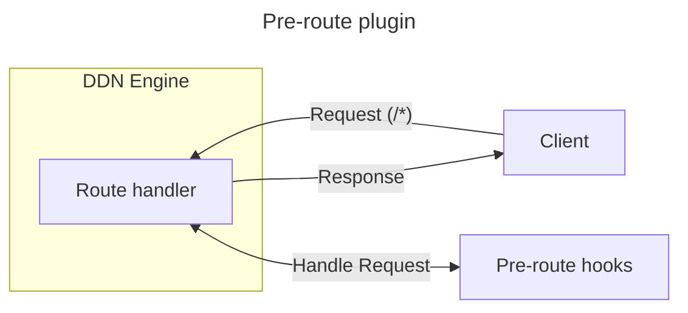
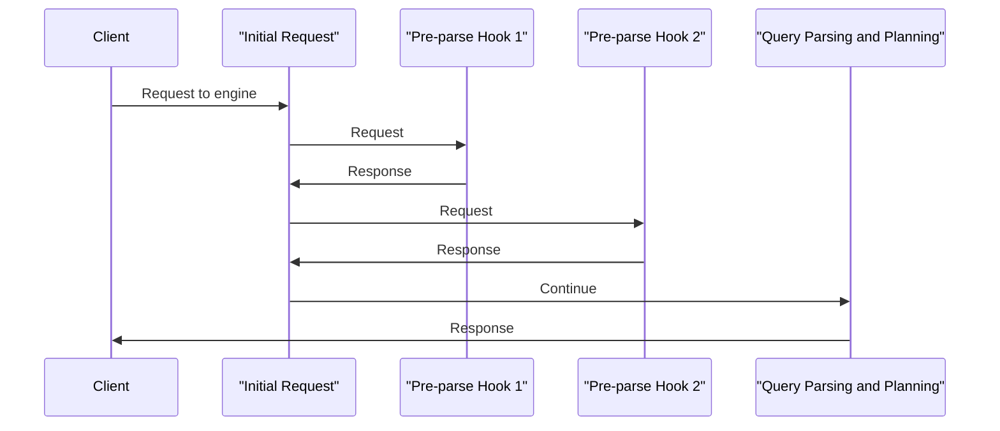
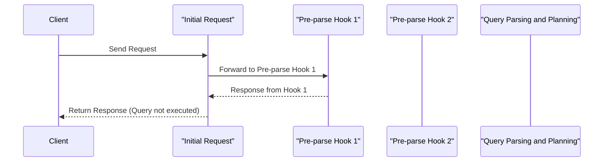
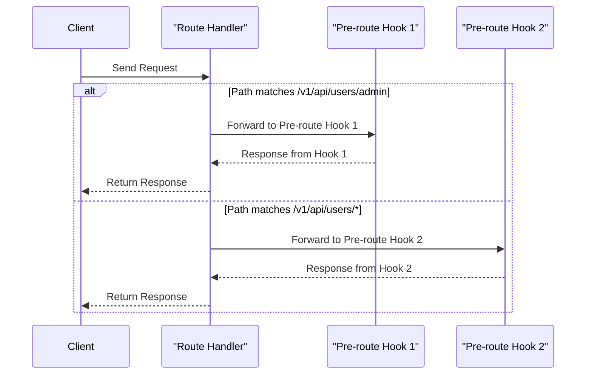

import Thumbnail from "@site/src/components/Thumbnail";

# How Plugins Work

## Introduction

Engine plugins are HTTP servers that run alongside a Hasura DDN instance and can be written in any language capable of
running an HTTP server.

They are configured in DDN using metadata. The engine sends HTTP requests to the plugin at the specified execution step,
the plugin processes the request, and then sends a response back to the engine, which continues execution based on the
plugin's response.

Plugins can be applied at the following steps:

| Execution Step   | Description                                                                                                                                          | Example Usage                                                                |
| ---------------- | ---------------------------------------------------------------------------------------------------------------------------------------------------- | ---------------------------------------------------------------------------- |
| **Pre-Parse**    | The first step in the execution pipeline, where custom logic can be applied before the query is parsed and its internal representation is generated. | Add an allowlist layer to restrict access to specific queries and mutations. |
| **Pre-Response** | The final step in the execution pipeline, where custom logic can be added after the query is executed but before the response is sent to the client. | Trigger Slack notifications after a mutation is executed.                    |
| **Pre-Route**    | The first step in the routing pipeline, where custom logic can be applied to the requests on other than pre-defined endpoints.                       | Add a custom endpoint to DDN.                                                |

## Architecture





## Plugin Configuration

Engine plugins are configured in DDN using metadata. The metadata specifies the URL of the engine plugin and the
execution step at which the plugin should be called. The configuration also can control the request that is sent to the
engine plugin.

```yaml title="Here is an example of a plugin configuration in DDN metadata:"
kind: LifecyclePluginHook
version: v1
definition:
  name: cloudflare allowlist
  url:
    valueFromEnv: ALLOW_LIST_URL
  pre: parse
  config:
    request:
      headers:
        additional:
          hasura-m-auth:
            value: "your-strong-m-auth-key"
      session: {}
      rawRequest:
        query: {}
        variables: {}
```

In this example, the plugin is configured to run at the `pre-parse` execution step. The plugin is called
`cloudflare allowlist`. The URL of the plugin is read from the `ALLOW_LIST_URL` environment variable. The plugin is
configured to add a `hasura-m-auth` header to the request with the value `your-strong-m-auth-key`.

Additionally, the request sent to the plugin includes the query and variables from the incoming GraphQL request, as well
as the session information from the incoming request.

## Pre-Parse Plugin

The `pre-parse` plugin is triggered at the first step in the execution pipeline, before the query is parsed. Use this
step to add custom logic before parsing begins.

For pre-parse plugin configuration
[click here](reference/metadata-reference/engine-plugins.mdx#lifecyclepluginhook-lifecyclepreparsepluginhook).

### Pre-Parse Plugin Request

```json title="A sample request that is sent to the pre-parse plugin is as follows:"
{
  "rawRequest": {
    "query": "query MyQuery { getAuthorById(author_id: 10) { first_name } }",
    "variables": {},
    "operationName": "MyQuery"
  },
  "session": {
    "role": "user",
    "variables": {
      "x-hasura-role": "user",
      "x-hasura-user-id": "123"
    }
  }
}
```

:::info Customize the request

The request sent to the plugin can be customized based on the plugin's
[configuration](reference/metadata-reference/engine-plugins.mdx#lifecyclepluginhook-lifecyclepreresponsepluginhookconfigrequest).

:::

### Pre-Parse Plugin Response

The `pre-parse` plugin has the ability to control the execution pipeline by returning a specific response to DDN. The
response determines whether execution continues, halts, or returns an error. The possible response types are:

| Response Type    | HTTP Status Code | Response Body | Description                                                                                    |
| ---------------- | ---------------- | ------------- | ---------------------------------------------------------------------------------------------- |
| `Continue`       | `204`            | None          | Execution continues without interruption.                                                      |
| `Response`       | `200`            | Response body | Execution halts, and the provided response is returned to the client.                          |
| `User Error`     | `400`            | Error object  | Execution halts, and the provided error is returned to the client as a user error.             |
| `Internal Error` | `500`            | Error object  | Execution halts, and the provided error is returned to the client as an internal server error. |

:::warning Response Validation

DDN does not validate the plugin's response. It is the plugin's responsibility to ensure the response is valid and
aligns with its intended logic.

:::

### Use Cases

The `pre-parse` plugin can be used to add a multitude of functionalities to DDN. Some use cases are:

- **Allowlist**: Add an allowlist layer to restrict access to specific queries and mutations based on the incoming
  request and session information.
- **Basic Rate Limiting**: Implement rate limiting to restrict the total number of requests that can be made to DDN in a
  given time period.
- **Custom Query Validation**: Add custom query validation logic to ensure that the incoming query is valid based on
  custom business logic.
- **Cache Get**: Implement a cache get layer to fetch the response from the cache before executing the query.

### Multiple Pre-Parse Plugins

You can configure multiple pre-parse plugins in DDN metadata. These plugins execute in the order they are listed in the
metadata configuration.

If a plugin returns a `Response`, `User Error`, or `Internal Error`, the execution stops immediately, and the response
is sent back to the client. Any plugins defined after that will not run.

Let’s consider an example where the engine uses two pre-parse plugins: `Pre-parse Hook 1` and `Pre-parse Hook 2`.



Here’s how the process works:

#### Case 1: Continue

If `Pre-parse Hook 1` returns a `Continue` response (HTTP status code 204), the engine proceeds to send the request to
`Pre-parse Hook 2`. This continues until all configured pre-parse plugins have been executed.

:::tip Continue response body

The `Continue` response body is ignored by DDN. Plugins returning a `Continue` response can safely leave the body empty.

:::

#### Case 2: Response, User Error, or Internal Error

If `Pre-parse Hook 1` returns any of the following:

- `Response` (HTTP status code 200)
- `User Error` (HTTP status code 400)
- `Internal Error` (HTTP status code 500)

The engine stops further execution and sends the response to the client and other plugins will not be called.



:::info Will subsequent pre-response plugins execute?

Yes, even if a pre-parse plugin returns a `Response`, `User Error`, or `Internal Error`, the subsequent `pre-response`
plugins will still execute.

:::

If all pre-parse plugins return a `Continue` response (HTTP status code 204), the engine completes execution and sends
its generated response to the client.

:::info Can pre-parse plugins modify the request?

No, pre-parse plugins cannot alter the request itself. They only influence the execution pipeline by returning specific
responses.

:::

## Pre-Response Plugin

The `pre-response` plugin is triggered at the final step in the execution pipeline after the query is executed. Use this
step to add webhooks after the query is executed. Please note that the `pre-response` plugin cannot control or change
the execution pipeline.

For pre-response plugin configuration
[click here](reference/metadata-reference/engine-plugins.mdx#lifecyclepluginhook-lifecyclepreresponsepluginhook).

### Pre-Response Plugin Request

```json title="A sample request that is sent to the pre-response plugin is as follows:"
{
  "response": {
    "data": {
      "getAuthorById": {
        "first_name": "John"
      }
    }
  },
  "session": {
    "role": "user",
    "variables": {
      "x-hasura-role": "user",
      "x-hasura-user-id": "123"
    }
  },
  "rawRequest": {
    "query": "query MyQuery { getAuthorById(author_id: 10) { first_name } }",
    "variables": {},
    "operationName": "MyQuery"
  }
}
```

:::info Customize the request

The request sent to the plugin can be customized based on the plugin's
[configuration](reference/metadata-reference/engine-plugins.mdx#lifecyclepluginhook-lifecyclepreresponsepluginhookconfigrequest).

:::

### Pre-Response Plugin Response

The `pre-response` plugin cannot control the execution pipeline. The response from the plugin is ignored by DDN.

### Use Cases

The `pre-response` plugin can be used to add a number of functionalities to DDN. Some use cases also make use of the
pre-parse plugin. They are:

- **Slack Notifications**: Trigger Slack notifications after a query/mutation is executed.
- **Cache Set**: Implement a cache set layer to store the response in the cache.
- **Cache Invalidation**: Implement a cache invalidation layer to invalidate the cache based on the incoming request and
  session information.
- **Audit Logs**: Add audit logs to track the queries and mutations executed by the users.

### Multiple Pre-Response Plugins

Multiple `pre-response` plugins can be configured in DDN metadata.

The engine sends requests to all configured `pre-response` plugins in parallel. It does not wait for responses from the
plugins and immediately sends the response generated by the engine to the client.

## Pre-Route Plugin

The `pre-route` plugin is triggered at the first step in the routing stage, before the request is routed to the handler.
Use this step to add custom HTTP handlers to DDN. Please note that the pre-route plugin can only handle requests that do
not match DDN's pre-defined endpoints (`/graphql`, `/v1/sql`, `/v1/jsonapi`, `/v1/explain`, `/healthz` and `/metrics`).

[See the reference here](reference/metadata-reference/engine-plugins.mdx#lifecyclepluginhook-lifecyclepreroutepluginhook)
for pre-route plugin metadata configuration.

### Pre-Route Plugin Request

A sample request that is sent to the `pre-route` plugin is as follows:

```json
{
  "path": "/v1/rest/users/5",
  "method": "POST",
  "query": "limit=10&offset=0"
  "body": {
    "name_like": "%foo%"
  }
}
```

:::info Customize the request

The request sent to the plugin can be customized based on the plugin's
[configuration](reference/metadata-reference/engine-plugins.mdx#lifecyclepluginhook-lifecyclepreroutepluginhookconfigrequest).

:::

### Pre-Route Plugin Response

The `pre-route` plugin have absolute control over the execution pipeline for the configured path. The plugin can return
any of the following responses to DDN:

| Response Type    | HTTP Status Code | Response Body | Description                                                 |
| ---------------- | ---------------- | ------------- | ----------------------------------------------------------- |
| `Success`        | `200`            | Response body | Return the response to the client.                          |
| `User Error`     | `400`            | Error object  | Stop the execution and return the error to the client.      |
| `Internal Error` | `500`            | Error object  | Stop the execution and return internal error to the client. |

### Use Cases

The `pre-route` plugin can be used to add custom endpoints to DDN which are not part of the pre-defined DDN endpoints.
Some use cases are:

- **RESTified Endpoints**: Turn GraphQL queries into REST endpoints.
- **Internal tools**: Add internal tools like graphql schema visualizers like graphql-voyager, Swagger UI for JSON API,
  etc.

### Multiple Pre-Route Plugins

Multiple `pre-route` plugins can be configured in DDN metadata to handle requests to different paths. However, if more
than one plugin matches the request path, the first plugin in the list is executed and the subsequent plugins are
ignored.

So, while defining multiple `pre-route` plugins, make sure that the more specific paths are defined first.

Let's take an example where the engine is configured with two `pre-route` plugins: `Pre-route hook 1` (for path
`/v1/api/users/admin`) and `Pre-route hook 2` (for path `/v1/api/users/*`). We want to handle the request to GET admin
user details (a more specific path) using `Pre-route hook 1` and the request to GET user with an ID (a less specific
path) using `Pre-route hook 2`. For this, we need to define the `Pre-route hook 1` first in the metadata.



In this example, the engine is configured with two `pre-route` plugins. The engine sends the request to either
`Pre-route hook 1` or `Pre-route hook 2` based on the path. If the path matches `/v1/api/users/admin`, the engine sends
the request to `Pre-route hook 1`. If the path matches `/v1/api/users/*`, the engine sends the request to
`Pre-route hook 2`.
